# Diagrama de clases — Liquid Staking & Staking Derivatives

Vista estructural de contratos, interfaces y librerías (módulo 18).  
**Sync:** 2026-09-14 · Fases **0–1** ✅ (`StETH` + `ShareMath` implementados).

## Diagrama (Mermaid)

```mermaid
classDiagram
    direction TB

    class ILiquidStakingPool {
        <<interface>>
        +submit() payable uint256
        +getTotalPooledEther() uint256
        +getSharesByPooledEth(ethAmount) uint256
        +getPooledEthByShares(sharesAmount) uint256
        +handleOracleReport(clBalance, elRewards, timestamp)
    }

    class IStETH {
        <<interface>>
        +sharesOf(account) uint256
        +getTotalShares() uint256
        +transferShares(to, sharesAmount) uint256
        +balanceOf(account) uint256
        +transfer(to, amount) bool
        +approve(spender, amount) bool
    }

    class IWstETH {
        <<interface>>
        +wrap(stETHAmount) uint256
        +unwrap(wstETHAmount) uint256
        +getWstETHByStETH(stETHAmount) uint256
        +getStETHByWstETH(wstETHAmount) uint256
        +stEthPerToken() uint256
        +tokensPerStEth() uint256
    }

    class IWithdrawalQueue {
        <<interface>>
        +requestWithdrawals(amounts, owner) uint256[]
        +finalize(lastRequestIdToBeFinalized, maxShareRate)
        +claimWithdrawal(requestId)
        +getWithdrawalStatus(requestIds) WithdrawalRequestStatus[]
        +isFinalized(requestId) bool
        +isClaimed(requestId) bool
    }

    class IAccountingOracle {
        <<interface>>
        +submitReportData(report, contractVersion)
        +getLastProcessingRefSlot() uint256
        +getConsensusContract() address
    }

    class IDepositContract {
        <<interface>>
        +deposit(pubkey, withdrawalCredentials, signature, depositDataRoot) payable
        +get_deposit_root() bytes32
        +get_deposit_count() bytes
    }

    class LiquidStakingErrors {
        <<errors>>
        +UnauthorizedOracle()
        +ZeroDeposit()
        +InsufficientBalance()
        +InvalidReport()
        +ReportTooEarly()
        +NegativeRebaseBlocked()
        +WithdrawalNotFinalized()
        +WithdrawalAlreadyClaimed()
        +WithdrawalNotOwner()
        +FeeCapExceeded()
        +EthTransferFailed()
        +ZeroAddress()
        +Paused()
    }

    class ShareMath {
        <<library>>
        +WAD uint256
        +RAY uint256
        +ethToShares(ethAmount, totalEth, totalShares) uint256
        +sharesToEth(sharesAmount, totalEth, totalShares) uint256
        +mulDiv(a, b, denominator) uint256
    }

    class FeeDistributor {
        +protocolFeeBps uint16
        +MAX_PROTOCOL_FEE_BPS uint16
        +treasury address
        +nodeOperatorsRegistry address
        +splitRewards(totalRewards) FeeSplit
        +setFeeRecipients(treasury, operators)
    }

    class StETH {
        +totalShares uint256
        +shares mapping
        +allowances mapping
        +submit() payable uint256
        +_mintShares(recipient, sharesAmount)
        +_burnShares(account, sharesAmount)
        +_getTotalPooledEther() uint256
        +transferShares(to, sharesAmount) uint256
        +sharesOf(account) uint256
        +balanceOf(account) uint256
    }

    class WstETH {
        +stETH IStETH
        +wrap(stETHAmount) uint256
        +unwrap(wstETHAmount) uint256
        +stEthPerToken() uint256
        +tokensPerStEth() uint256
    }

    class LiquidStakingPool {
        +bufferedEther uint256
        +depositedValidators uint256
        +beaconBalance uint256
        +oracle address
        +withdrawalQueue address
        +depositContract IDepositContract
        +feeDistributor FeeDistributor
        +submit() payable uint256
        +depositBufferedEther(maxDeposits)
        +handleOracleReport(clBalance, elRewards, timestamp)
        +getTotalPooledEther() uint256
    }

    class AccountingOracle {
        +pool LiquidStakingPool
        +committee mapping
        +quorum uint256
        +lastReportTimestamp uint256
        +REPORT_INTERVAL uint256
        +submitReport(clBalance, elRewards, refSlot, signatures)
        +addOracleMember(member)
        +removeOracleMember(member)
    }

    class WithdrawalQueue {
        +stETH IStETH
        +lastRequestId uint256
        +lastFinalizedRequestId uint256
        +requests mapping
        +requestWithdrawals(amounts, owner) uint256[]
        +finalize(lastRequestId, maxShareRate)
        +claimWithdrawal(requestId)
        +getWithdrawalStatus(requestIds) Status[]
    }

    class WithdrawalRequest {
        <<struct>>
        +uint256 amountOfStETH
        +uint256 amountOfShares
        +address owner
        +uint40 timestamp
        +bool isFinalized
        +bool isClaimed
    }

    class NodeOperatorsRegistry {
        +operators mapping
        +activeKeysCount uint256
        +addNodeOperator(name, rewardAddress)
        +addSigningKeys(operatorId, keys, signatures)
        +getNextSigningKeys(count) keys
    }

    class MockDepositContract {
        <<mock>>
        +depositCount uint256
        +deposit(...) payable
    }

    class MockOracle {
        <<mock>>
        +submitReport(...)
    }

    ILiquidStakingPool <|.. LiquidStakingPool
    IStETH <|.. StETH
    IWstETH <|.. WstETH
    IWithdrawalQueue <|.. WithdrawalQueue
    IAccountingOracle <|.. AccountingOracle
    IDepositContract <|.. MockDepositContract
    IDepositContract <|.. DepositContractExternal

    StETH <|-- LiquidStakingPool : hereda / embebe accounting
    LiquidStakingPool --> ShareMath : usa
    LiquidStakingPool --> FeeDistributor : fees CL/EL
    LiquidStakingPool --> IDepositContract : deposits 32 ETH
    LiquidStakingPool --> NodeOperatorsRegistry : keys
    LiquidStakingPool --> AccountingOracle : solo oracle reporta
    LiquidStakingPool --> WithdrawalQueue : finaliza / fondea
    WstETH --> IStETH : wrap/unwrap
    WithdrawalQueue --> IStETH : lock shares
    WithdrawalQueue --> WithdrawalRequest : almacena
    AccountingOracle --> LiquidStakingPool : handleOracleReport
    AccountingOracle ..> LiquidStakingErrors : UnauthorizedOracle
```



## Responsabilidades

| Artefacto | Responsabilidad |
|-----------|-----------------|
| `StETH` | ERC-20 *rebasing*: `balanceOf` refleja ETH subyacente vía shares; mint/burn de shares en submit/withdraw |
| `WstETH` | Wrapper *value-accruing*: 1 wstETH = N shares fijas; no rebasea el balance ERC-20 |
| `LiquidStakingPool` | Buffer ETH, depósitos al Eth2 Deposit Contract, total pooled ether, recepción de reportes oracle |
| `AccountingOracle` | Comité autorizado; reportes CL balance + EL rewards; intervalo mínimo; firmas |
| `WithdrawalQueue` | Cola asíncrona por `requestId` (o NFT); finalize por oracle/pool; claim ETH |
| `FeeDistributor` | Split inmutable-capped entre stakers, treasury y node operators |
| `ShareMath` | Conversión shares ↔ ETH con precisión **WAD (1e18)** / **RAY (1e27)** |
| `NodeOperatorsRegistry` | Claves de validadores y direcciones de reward |
| `IDepositContract` | Interfaz del depósito Eth2 (`0x00000000219ab540356cBB839Cbe05303d7705Fa`) |

## Modelo dual de tokens

```
                    ┌─────────────────────────────────────┐
                    │     LiquidStakingPool / StETH       │
                    │  totalPooledEther / totalShares     │
                    └──────────────┬──────────────────────┘
                                   │
              shares-based         │         value-accruing
              (rebasing)           │         (wrapper)
                                   │
                    ┌──────────────┴──────────────┐
                    ▼                             ▼
              balanceOf(user)              WstETH.balanceOf(user)
              = shares * rate              = shares wrapped (fijo)
              rate = pooledEth/shares      stEthPerToken crece
```

## Errores custom (propuestos)

| Error | Uso |
|-------|-----|
| `UnauthorizedOracle()` | Reporter no autorizado (obligatorio `.cursorrules`) |
| `ZeroDeposit()` | `msg.value == 0` en submit |
| `InvalidReport()` / `ReportTooEarly()` | Datos o timing de oracle inválidos |
| `WithdrawalNotFinalized()` / `WithdrawalAlreadyClaimed()` | Ciclo de cola |
| `FeeCapExceeded()` | Fee protocol > cap inmutable |
| `EthTransferFailed()` | `.call{value}` fallido |
| `ZeroAddress()` / `Paused()` | Validaciones de acceso y pausa |
