# Diagrama de clases — Liquid Staking & Staking Derivatives

Vista estructural alineada a la implementación v1 (módulo 18).  
**Sync:** 2026-09-14 · Fases **0–7** ✅ (v1 cerrado · 90 PASS).

> **Nota de diseño:** no existe `LiquidStakingPool.sol` separado. El pool es **`StETH`**, que implementa `IStETH` + `ILiquidStakingPool` (+ `IWithdrawalFinalizer` en el mismo contrato).

## Diagrama (Mermaid)

```mermaid
classDiagram
    direction TB

    class ILiquidStakingPool {
        <<interface>>
        +handleOracleReport(clBalance, elRewards)
    }

    class IStETH {
        <<interface>>
        +submit() payable uint256
        +submit(referral) payable uint256
        +sharesOf(account) uint256
        +getTotalShares() uint256
        +getTotalPooledEther() uint256
        +balanceOf(account) uint256
        +getSharesByPooledEth(ethAmount) uint256
        +getPooledEthByShares(sharesAmount) uint256
        +transferShares(to, sharesAmount) uint256
        +transfer(to, amount) bool
        +approve(spender, amount) bool
        +allowance(owner, spender) uint256
        +transferFrom(from, to, amount) bool
    }

    class IWstETH {
        <<interface>>
        +wrap(stETHAmount) uint256
        +unwrap(wstETHAmount) uint256
        +stETH() address
        +stEthPerToken() uint256
        +tokensPerStEth() uint256
        +getWstETHByStETH(stETHAmount) uint256
        +getStETHByWstETH(wstETHAmount) uint256
    }

    class IWithdrawalQueue {
        <<interface>>
        +requestWithdrawals(amounts, owner) uint256[]
        +finalize(lastRequestIdToBeFinalized)
        +claimWithdrawal(requestId)
        +getLastRequestId() uint256
        +getLastFinalizedRequestId() uint256
        +getWithdrawalStatus(requestIds) WithdrawalRequestStatus[]
    }

    class IWithdrawalFinalizer {
        <<interface>>
        +finalizeWithdrawals(sharesAmount, ethAmount)
    }

    class IAccountingOracle {
        <<interface>>
        +pool() address
        +reportInterval() uint256
        +lastReportTimestamp() uint256
        +members(account) bool
        +memberCount() uint256
        +submitReport(clBalance, elRewards)
    }

    class IDepositContract {
        <<interface>>
        +deposit(pubkey, withdrawalCredentials, signature, depositDataRoot) payable
        +get_deposit_root() bytes32
        +get_deposit_count() bytes
    }

    class INodeOperatorsRegistry {
        <<interface>>
        +addNodeOperator(name, rewardAddress) uint256
        +addSigningKeys(operatorId, count, pubkeys, signatures)
        +assignNextSigningKeys(depositsCount) pubkeys, signatures
        +getUnusedSigningKeyCount() uint256
        +getNodeOperatorsCount() uint256
    }

    class LiquidStakingErrors {
        <<errors>>
        +UnauthorizedOracle()
        +ZeroDeposit()
        +InsufficientBalance()
        +InvalidReport()
        +ReportTooEarly()
        +NegativeRebaseBlocked()
        +WithdrawalNotFinalized()
        +WithdrawalAlreadyClaimed()
        +WithdrawalNotOwner()
        +FeeCapExceeded()
        +EthTransferFailed()
        +ZeroAddress()
        +Paused()
        +NoSigningKeys()
        +MathDivisionByZero()
        +OnlyPool()
        +OnlyWithdrawalQueue()
    }

    class ShareMath {
        <<library>>
        +WAD uint256
        +RAY uint256
        +ethToShares(ethAmount, totalEth, totalShares) uint256
        +sharesToEth(sharesAmount, totalEth, totalShares) uint256
        +mulDiv(a, b, denominator) uint256
        +shareRateRay(totalEth, totalShares) uint256
    }

    class FeeDistributor {
        +MAX_PROTOCOL_FEE_BPS uint16
        +protocolFeeBps uint16
        +treasuryShareBps uint16
        +treasury address
        +nodeOperators address
        +feeOnReward(reward) uint256
        +splitShares(feeShares) treasuryShares, operatorShares
    }

    class StETH {
        +bufferedEther uint256
        +clBalance uint256
        +depositedValidators uint256
        +oracle address
        +feeDistributor FeeDistributor
        +depositContract IDepositContract
        +operatorsRegistry INodeOperatorsRegistry
        +withdrawalQueue address
        +submit() payable uint256
        +handleOracleReport(newClBalance, elRewards)
        +depositBufferedEther(maxDeposits) uint256
        +finalizeWithdrawals(sharesAmount, ethAmount)
        +getTotalPooledEther() uint256
        +getBufferedEther() uint256
        +getClBalance() uint256
    }

    class WstETH {
        +stETH IStETH
        +wrap(stETHAmount) uint256
        +unwrap(wstETHAmount) uint256
        +receive() payable
        +stEthPerToken() uint256
        +tokensPerStEth() uint256
    }

    class AccountingOracle {
        +pool ILiquidStakingPool
        +reportInterval uint256
        +lastReportTimestamp uint256
        +members mapping
        +memberCount uint256
        +submitReport(clBalance, elRewards)
        +addMember(member)
        +removeMember(member)
    }

    class WithdrawalQueue {
        +stETH IStETH
        +finalizer IWithdrawalFinalizer
        +lastRequestId uint256
        +lastFinalizedRequestId uint256
        +requests mapping
        +requestWithdrawals(amounts, owner) uint256[]
        +finalize(lastRequestIdToBeFinalized)
        +claimWithdrawal(requestId)
        +setFinalizer(finalizer_)
    }

    class WithdrawalRequest {
        <<struct>>
        +address owner
        +uint256 shares
        +uint256 claimableEther
        +uint40 timestamp
        +bool isFinalized
        +bool isClaimed
    }

    class NodeOperatorsRegistry {
        +pool address
        +operators mapping
        +addNodeOperator(name, rewardAddress) uint256
        +addSigningKeys(operatorId, count, pubkeys, signatures)
        +assignNextSigningKeys(depositsCount) pubkeys, signatures
        +getUnusedSigningKeyCount() uint256
        +setPool(pool_)
    }

    class MockDepositContract {
        <<mock>>
        +depositCount uint256
        +deposit(...) payable
        +get_deposit_root() bytes32
        +get_deposit_count() bytes
    }

    ILiquidStakingPool <|.. StETH
    IStETH <|.. StETH
    IWithdrawalFinalizer <|.. StETH
    IWstETH <|.. WstETH
    IWithdrawalQueue <|.. WithdrawalQueue
    IAccountingOracle <|.. AccountingOracle
    IDepositContract <|.. MockDepositContract
    INodeOperatorsRegistry <|.. NodeOperatorsRegistry

    StETH --> ShareMath : usa
    StETH --> FeeDistributor : feeOnReward / splitShares
    StETH --> IDepositContract : deposit 32 ETH
    StETH --> INodeOperatorsRegistry : assignNextSigningKeys
    StETH --> AccountingOracle : solo oracle reporta
    StETH --> WithdrawalQueue : finalizeWithdrawals
    WstETH --> IStETH : wrap/unwrap
    WithdrawalQueue --> IStETH : lock shares
    WithdrawalQueue --> IWithdrawalFinalizer : burn+unlock
    WithdrawalQueue --> WithdrawalRequest : almacena
    AccountingOracle --> ILiquidStakingPool : handleOracleReport
    AccountingOracle ..> LiquidStakingErrors : UnauthorizedOracle
    NodeOperatorsRegistry ..> LiquidStakingErrors : OnlyPool
```



## Responsabilidades

| Artefacto | Responsabilidad |
|-----------|-----------------|
| `StETH` | Pool unificado: submit → mint shares; buffer+CL; oracle; deposits Eth2; `finalizeWithdrawals` |
| `WstETH` | Wrapper value-accruing: 1 wstETH = 1 share; wrap/unwrap; `receive()` ETH→submit+wrap |
| `AccountingOracle` | Membership on-chain; intervalo; `submitReport` → `handleOracleReport` (sin EIP-712 en v1) |
| `WithdrawalQueue` | Cola `requestId`: lock shares → finalize → claim ETH (CEI) |
| `FeeDistributor` | Cap inmutable 10%; `feeOnReward` + `splitShares` treasury/operators |
| `ShareMath` | `ethToShares` / `sharesToEth` / `mulDiv` / `shareRateRay` (WAD/RAY) |
| `NodeOperatorsRegistry` | Operators + keys 48/96; `assignNextSigningKeys` solo pool |
| `IDepositContract` | Spec Eth2 (`0x00000000219ab540356cBB839Cbe05303d7705Fa`); mock en lab |

## Modelo dual de tokens

```
                    ┌─────────────────────────────────────┐
                    │              StETH (pool)           │
                    │  pooled = bufferedEther + clBalance │
                    │  totalShares / share rate           │
                    └──────────────┬──────────────────────┘
                                   │
              shares-based         │         value-accruing
              (rebasing)           │         (wrapper)
                                   │
                    ┌──────────────┴──────────────┐
                    ▼                             ▼
              balanceOf(user)              WstETH.balanceOf(user)
              = shares * rate              = shares wrapped (fijo)
              rate = pooledEth/shares      stEthPerToken crece
```

## Errores custom (implementados)

| Error | Uso |
|-------|-----|
| `UnauthorizedOracle()` | Reporter ≠ `oracle` / no miembro (`AccountingOracle`) |
| `ZeroDeposit()` | `msg.value == 0` en submit |
| `InvalidReport()` / `ReportTooEarly()` | EL rewards inconsistentes o intervalo |
| `NegativeRebaseBlocked()` | `pooled == 0` con `shares > 0` |
| `WithdrawalNotFinalized()` / `AlreadyClaimed()` / `NotOwner()` | Ciclo de cola |
| `FeeCapExceeded()` | Fee / treasuryShare > caps en constructor |
| `EthTransferFailed()` | `.call{value}` fallido |
| `ZeroAddress()` / `NoSigningKeys()` | Validaciones |
| `OnlyPool()` / `OnlyWithdrawalQueue()` | Access control cruzado |
| `MathDivisionByZero()` | `ShareMath.mulDiv` |
| `Paused()` | Reservado (no cableado en v1) |
