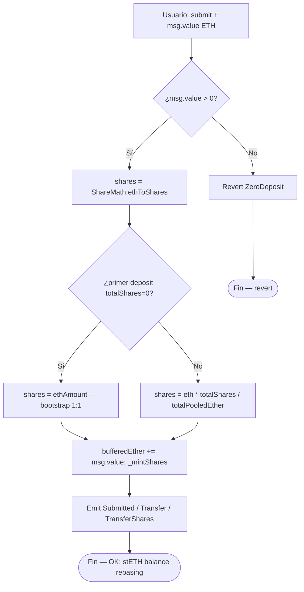
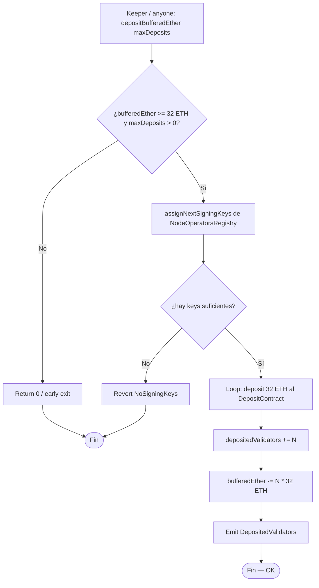
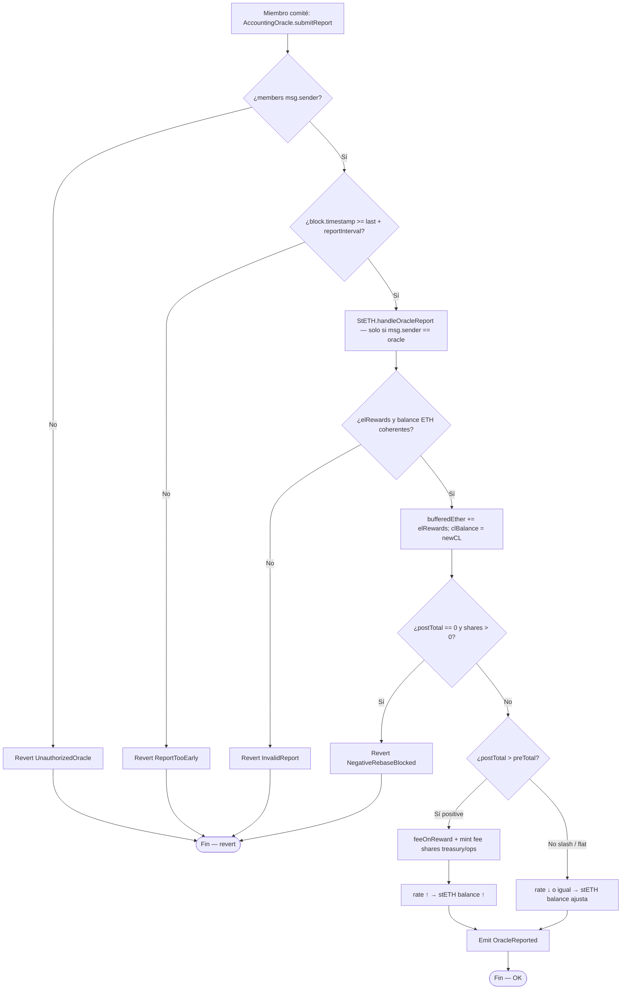
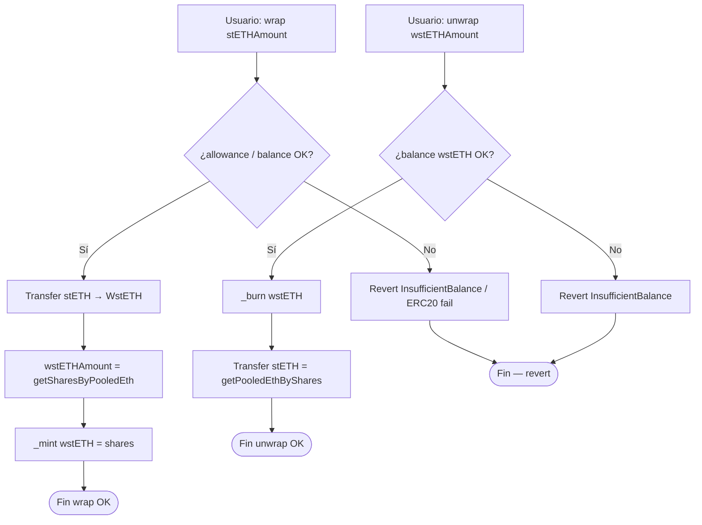
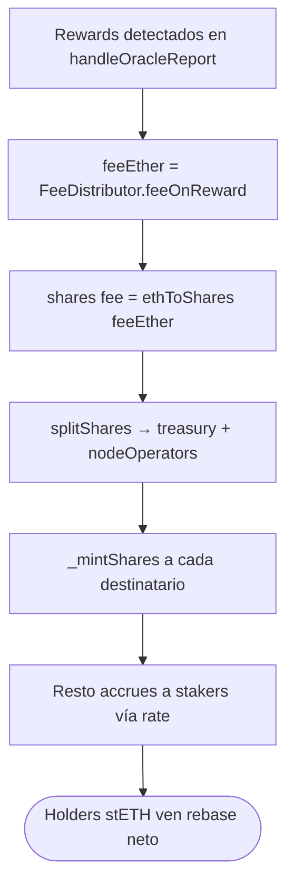

# Diagrama de flujo — Deposit, oracle rebase y withdrawal queue

Flujos de decisión internos del protocolo (módulo 18, **v1 implementado**).  
**Sync:** 2026-09-14 · Fases **0–7** ✅ · 90 PASS.

## 1. submit (ETH → shares / stETH)

> CEI: actualizar buffer y shares **antes** de cualquier llamada externa. ETH vía buffer interno (sin transfer out en submit).  
> `Paused` existe en `LiquidStakingErrors` pero **no** está cableado en v1.

---

## 2. depositBufferedEther → Eth2 Deposit Contract

---

## 3. Oracle report — positive / negative rebase

> Auth v1: **membership on-chain** (`msg.sender ∈ members`), sin firmas EIP-712 ni quorum multi-sig.  
> `balanceOf(stETH)` se ajusta sin transferencias (shares fijas, rate variable).  
> `wstETH.balanceOf` **no** cambia; `stEthPerToken()` sí.

---

## 4. Wrap / unwrap wstETH

> 1 wstETH = 1 share. `receive()` en WstETH: ETH → `stETH.submit` → wrap.

---

## 5. Withdrawal queue — request → finalize → claim

> CEI en claim: marcar `isClaimed` **antes** de `.call{value: ...}("")`.  
> `finalize`: `owner` **o** `finalizer` (deploy setea `finalizer = oracle`). Luego la queue llama `StETH.finalizeWithdrawals` (`OnlyWithdrawalQueue`).

---

## 6. Fee split en rewards

> Cap validado en **constructor** de `FeeDistributor` (`FeeCapExceeded` si `protocolFeeBps > 1000`).
