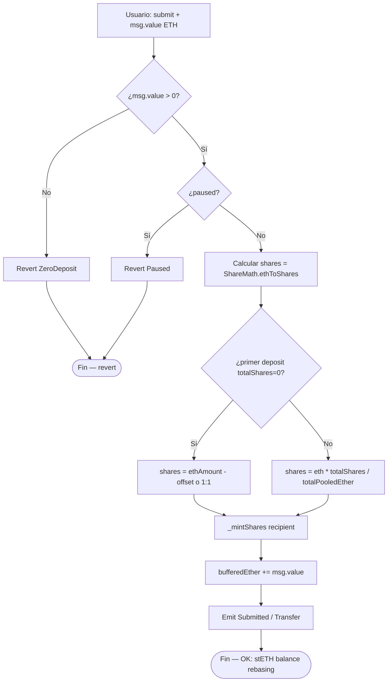
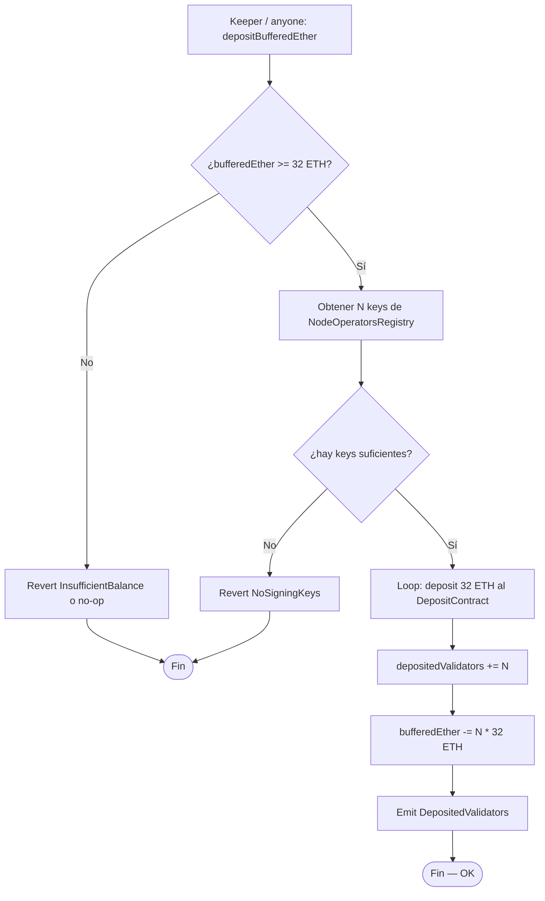
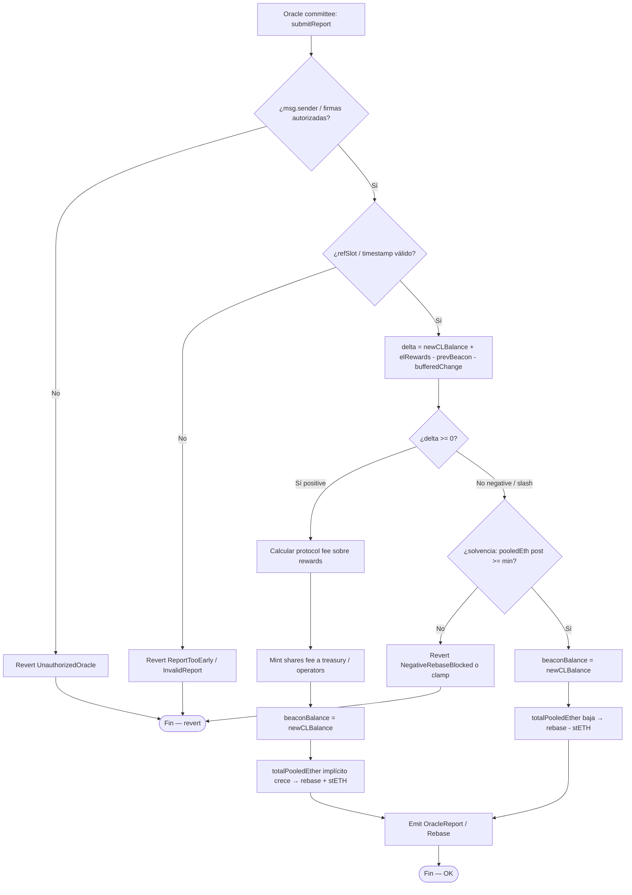
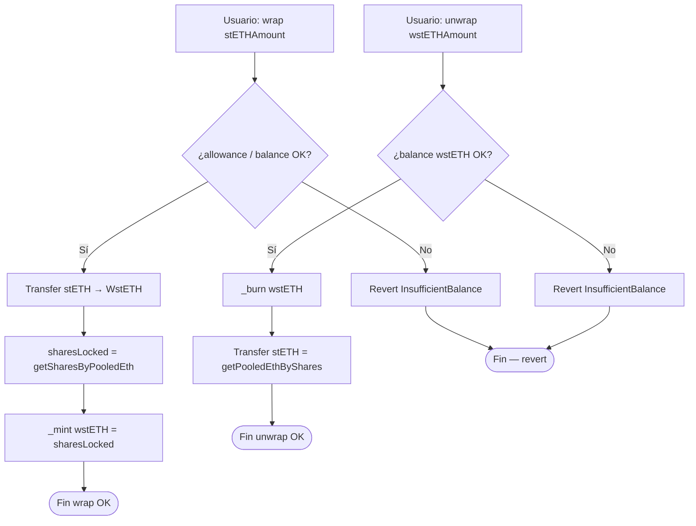
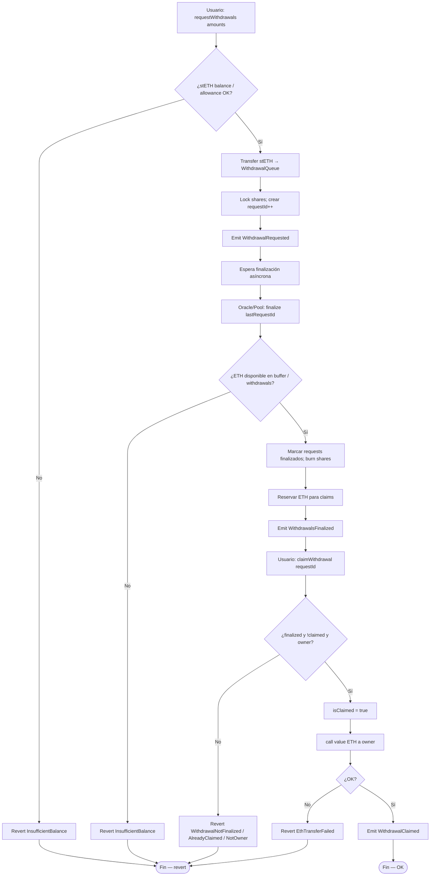
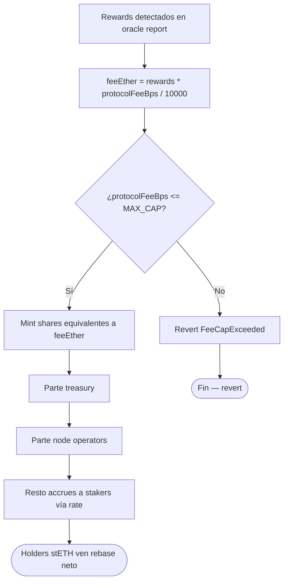

# Diagrama de flujo — Deposit, oracle rebase y withdrawal queue

Flujos de decisión internos del protocolo de liquid staking (módulo 18, **v1 — diseño**).  
**Sync:** 2026-09-14.

## 1. submit (ETH → shares / stETH)

> CEI: actualizar shares y buffer **antes** de cualquier llamada externa. ETH vía buffer interno (sin transfer out en submit).

---

## 2. depositBufferedEther → Eth2 Deposit Contract

---

## 3. Oracle report — positive / negative rebase

> `balanceOf(stETH)` de todos los holders se ajusta **sin transferencias** (shares fijas, rate variable).  
> `wstETH.balanceOf` **no** cambia; `stEthPerToken()` sí.

---

## 4. Wrap / unwrap wstETH

---

## 5. Withdrawal queue — request → finalize → claim

> CEI en claim: marcar `isClaimed` **antes** de `.call{value: ...}("")`.

---

## 6. Fee split en rewards

