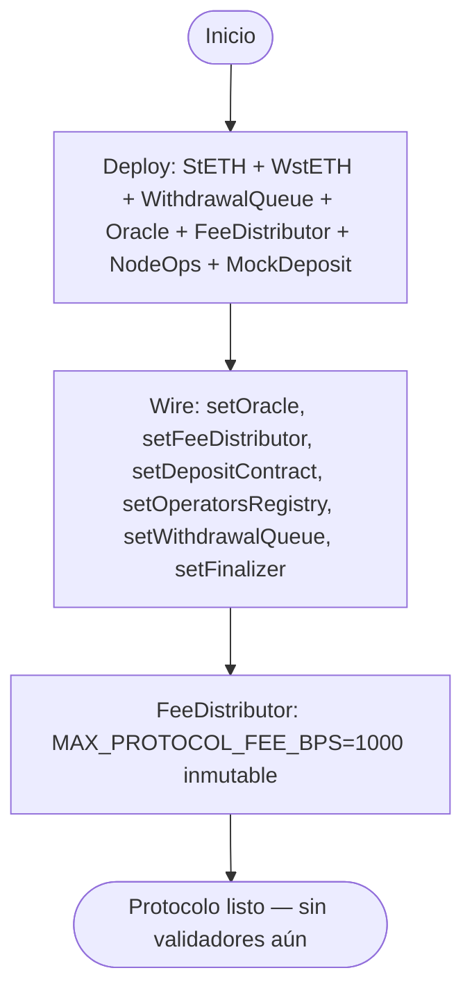
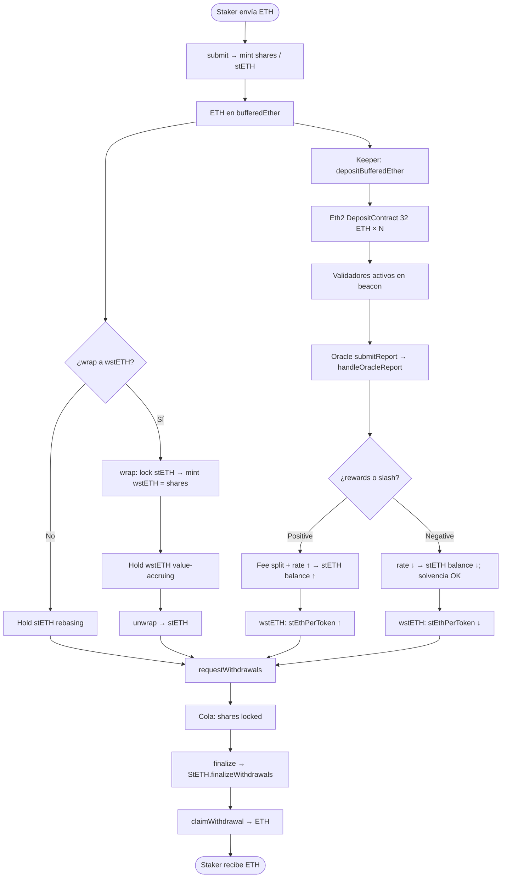
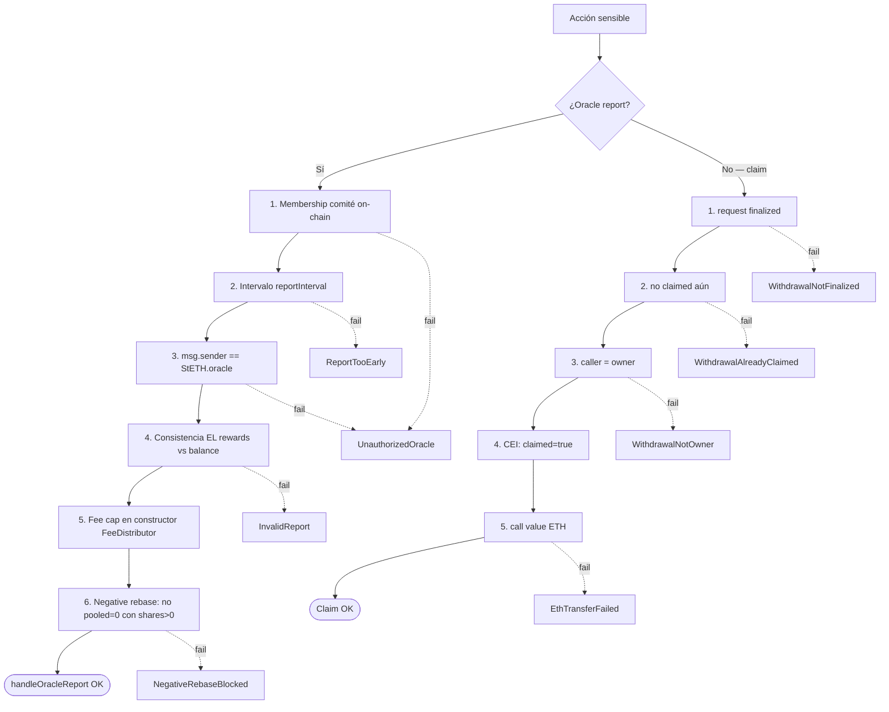
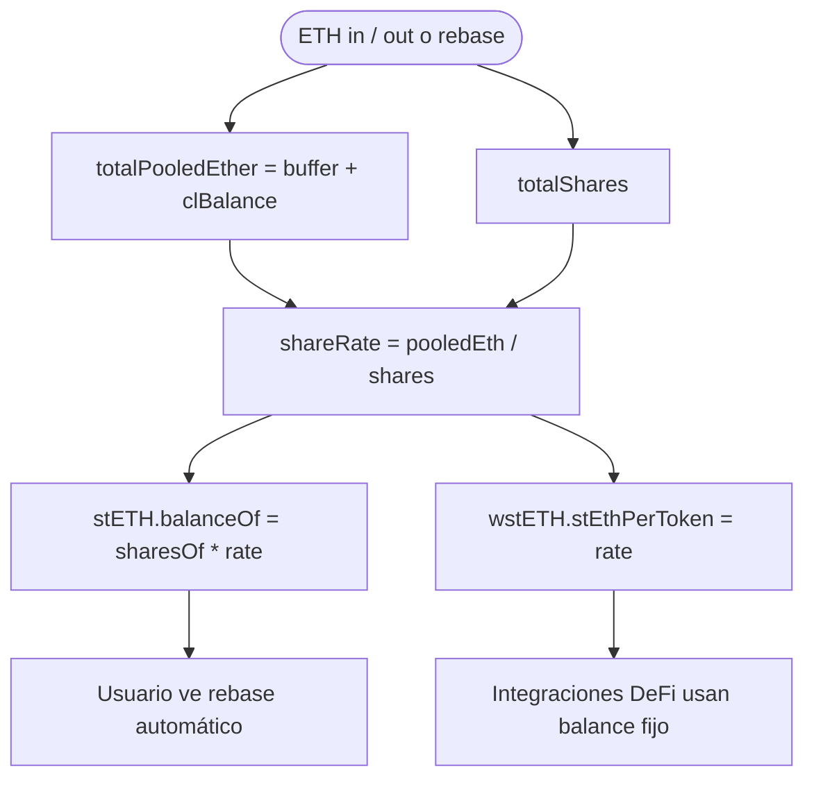
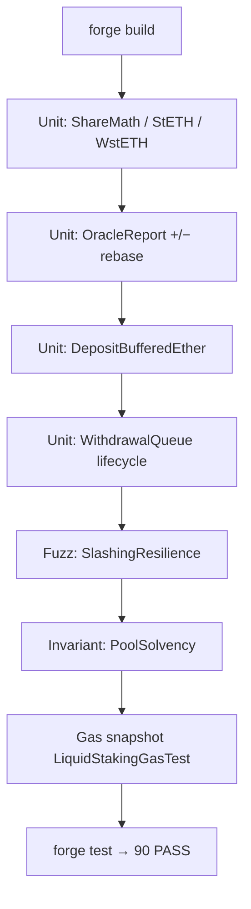

# Flujograma — Ciclo completo Liquid Staking Protocol

Flujo extremo a extremo entre stakers, pool, oracle, deposit contract y withdrawal queue (módulo 18, **v1 implementado**).  
**Sync:** 2026-09-14 · Fases **0–7** ✅ · 90 PASS.

## Actores

| Actor | Rol |
|-------|-----|
| Staker | Deposita ETH (`submit`); opcionalmente wrap a `wstETH`; solicita unstake |
| Node Operator | Aporta signing keys; recibe fee de rewards |
| Oracle Committee | Miembros on-chain llaman `submitReport` (CL + EL); dispara rebase |
| StETH (pool) | Contabilidad shares, buffer, CL, deposits, finalizeWithdrawals |
| WstETH | Wrapper no-rebasing para DeFi / composabilidad |
| WithdrawalQueue | Cola asíncrona request → finalize → claim |
| Eth2 Deposit Contract | Recibe depósitos de 32 ETH por validador (mock en lab) |
| FeeDistributor / Treasury | Split de fees con cap inmutable 10% |
| Keeper | Llama `depositBufferedEther` cuando buffer ≥ 32 ETH |
| CI / Foundry | Unit, fuzz rebase+/−, lifecycle withdrawal, invariantes, gas |

---

## Flujograma — Deploy

> Deploy lab: `queue.setFinalizer(address(oracle))`. Pueden finalizar `owner` o `finalizer`.

---

## Flujograma principal — Stake → Accrue → Unstake

---

## Flujograma — Capas de defensa (oracle + withdraw)

---

## Flujograma — Contabilidad shares (WAD / RAY)

---

## Flujograma — Tooling Foundry (lab)

---

## Relación con otros docs

| Documento | Contenido |
|-----------|-----------|
| [diagrama-de-clases.md](./diagrama-de-clases.md) | Contratos, interfaces, librerías (implementación) |
| [diagrama-de-flujo.md](./diagrama-de-flujo.md) | Decisiones internas por función |
| [planificacion.md](./planificacion.md) | Fases 0–7 cerradas, arquitectura v1 |
| [SWC-AUDIT.md](./SWC-AUDIT.md) | Matriz SWC |
| [GAS.md](./GAS.md) | Baseline gas |
