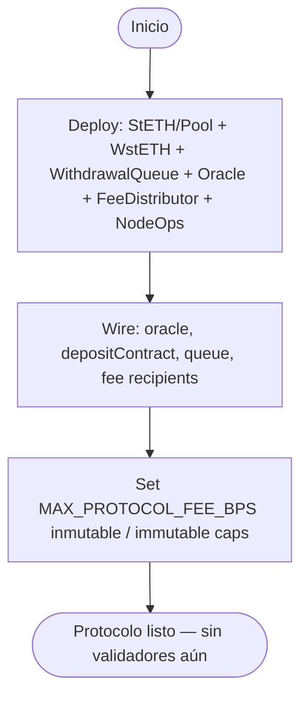
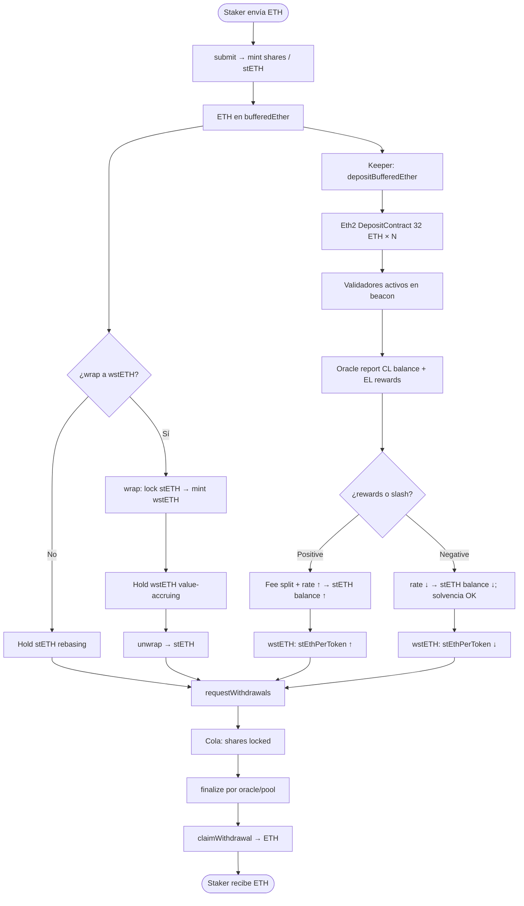
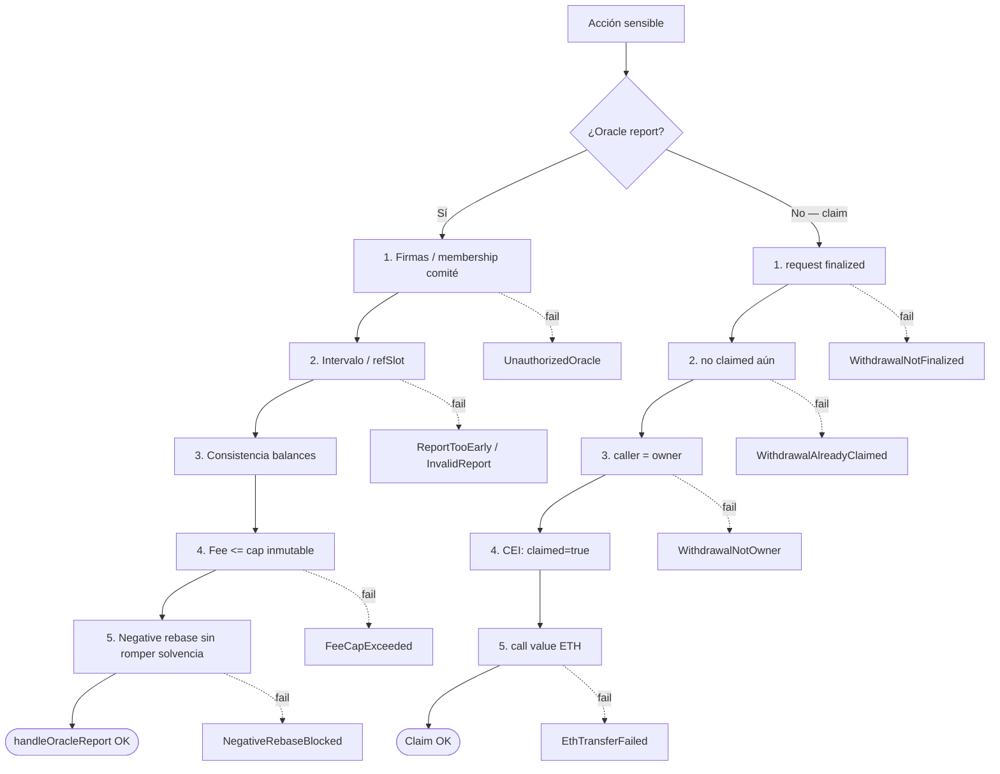
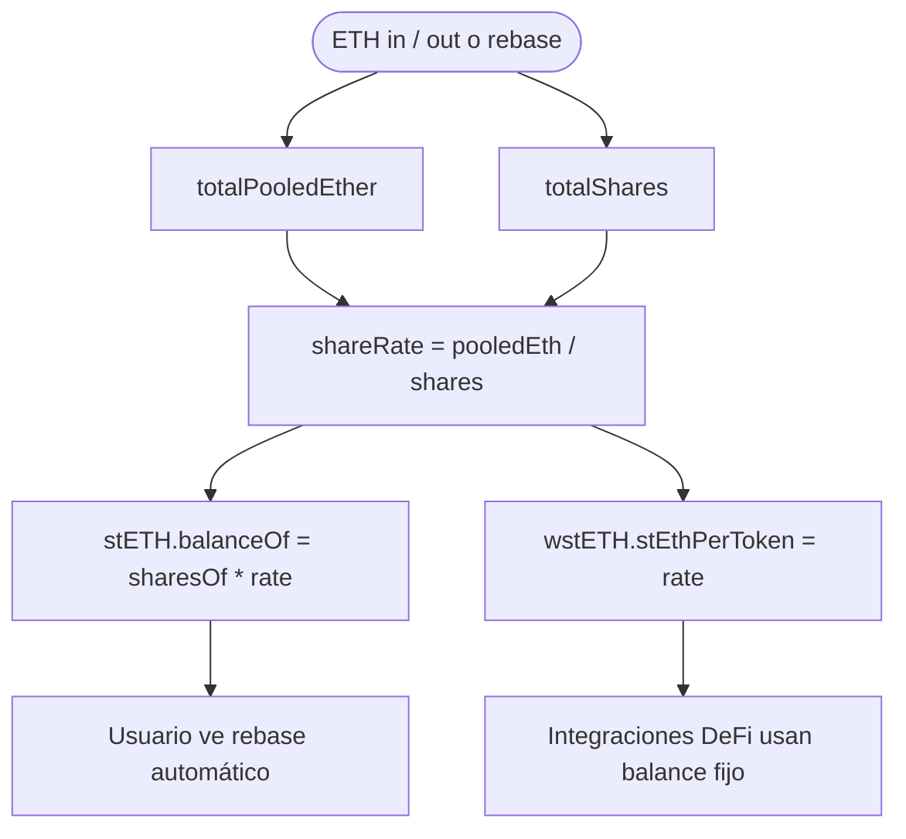
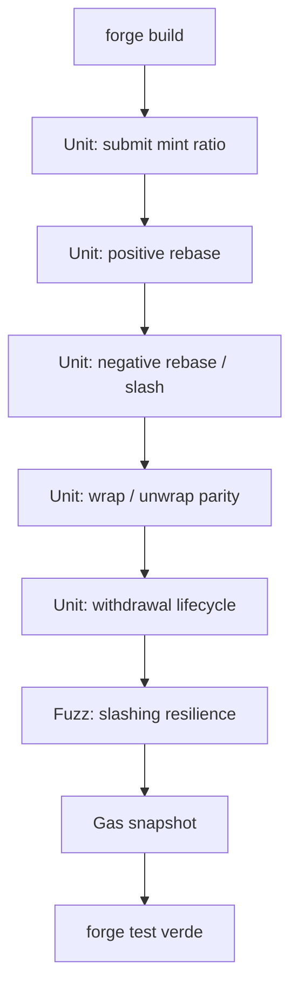

# Flujograma — Ciclo completo Liquid Staking Protocol

Flujo extremo a extremo entre stakers, pool, oracle, deposit contract y withdrawal queue (módulo 18, **v1 — diseño**).  
**Sync:** 2026-09-14.

## Actores

| Actor | Rol |
|-------|-----|
| Staker | Deposita ETH (`submit`); opcionalmente wrap a `wstETH`; solicita unstake |
| Node Operator | Aporta signing keys; recibe fee de rewards |
| Oracle Committee | Firma/reporta balances CL + rewards EL; dispara rebase |
| LiquidStakingPool / StETH | Contabilidad shares, buffer, total pooled ether |
| WstETH | Wrapper no-rebasing para DeFi / composabilidad |
| WithdrawalQueue | Cola asíncrona request → finalize → claim |
| Eth2 Deposit Contract | Recibe depósitos de 32 ETH por validador |
| FeeDistributor / Treasury | Split de fees con cap inmutable |
| Keeper | Llama `depositBufferedEther` cuando buffer ≥ 32 ETH |
| CI / Foundry | Unit, fuzz rebase+/−, lifecycle withdrawal, gas |

---

## Flujograma — Deploy

---

## Flujograma principal — Stake → Accrue → Unstake

---

## Flujograma — Capas de defensa (oracle + withdraw)

---

## Flujograma — Contabilidad shares (WAD / RAY)

---

## Flujograma — Tooling Foundry (lab)

---

## Relación con otros docs

| Documento | Contenido |
|-----------|-----------|
| [diagrama-de-clases.md](./diagrama-de-clases.md) | Contratos, interfaces, librerías |
| [diagrama-de-flujo.md](./diagrama-de-flujo.md) | Decisiones internas por función |
| [planificacion.md](./planificacion.md) | Fases con gate de autorización |
